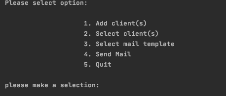

# Client Mailer
CRM &amp; client Mail system

A project to manage a list of clients which can then be emailed from a selection of email templates. This is controlled through a CLI menu.

# Preview



# Table of Contents

- [Project Title](*Client-Mailer)
- [Preview](*Preview)
- [Installation](*Installation)
- [Data](*Data)
- [Code](*Code)
- [Conclusion](*Conclusion)

# Installation

1. Start by cloning the repository:
```
git clone https://github.com/ChristopherBacon/Client-Mailer.git
cd ClientMailer'
```
2. Create a ```python 3.7.3``` environment.

3. Install dependencies

```
pip install requirements.txt
```
4. To run tests in terminal:
```
cd ClientMailer
pytest
```

# Data

1. ```emails/``` This is where the templates for the emails live. You can add templates to this manually as txt files.

2. ```clients.csv```Dictionary of pre-existing clients that can be uploaded and mailed.

# Code

1. [clients.py](clientmailerproj/clients.py) Contains the client class for creating clients, and also client helper functions for uploading clients.

2. [mailer.py](clientmailerproj/mailer.py) The mail server for the project. You can run in debug mode: ```python -m smtpd -c DebuggingServer -n localhost:1025```
then test your mail sending.

3. [mailtemplates.py](clientmailerproj/mailtemplates.py) Helper functions for checking emails and personalising for clients

4. [menu.py](clientmailerproj/menu.py)

# Conclusion
